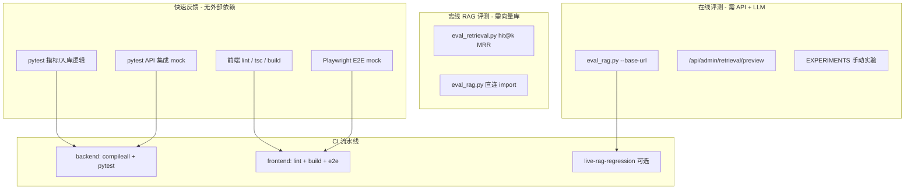

# 测试指导

赫尔墨斯（hermes-rag）的测试体系分为 **六层**：后端 pytest、检索离线评测、端到端 RAG 质量门禁、增强功能手动实验、前端 E2E、CI 流水线。本文是总索引——「能做哪些测试、怎么跑、有什么坑」。深度内容请跳转：

| 文档 | 定位 |
|------|------|
| [EVAL.md](EVAL.md) | 检索 hit@k / MRR 数据集格式与调参对比 |
| [RAG_EVALUATION.md](RAG_EVALUATION.md) | 端到端 RAG 指标、阈值门禁、CI 回归 |
| [EXPERIMENTS.md](EXPERIMENTS.md) | 四个增强功能（重写 / HyDE / 上下文分块 / 精排）人肉实验步骤 |

---

## 1. 测试全景概览

### 1.1 分层对照表

| 层级 | 工具 / 入口 | 自动化 | 需 LLM | 需向量库 | 需运行中服务 |
|------|-------------|--------|--------|----------|--------------|
| 后端 pytest | `pytest tests/` | 全自动 | 否（monkeypatch） | 否（mock） | 否 |
| 检索离线评测 | `scripts/eval_retrieval.py` | 半自动 CLI | 可选（rerank） | 是 | 否 |
| 端到端 RAG 门禁 | `scripts/eval_rag.py` | 半自动 CLI | 是 | 是 | 可选（`--base-url`） |
| 增强功能实验 | UI + [EXPERIMENTS.md](EXPERIMENTS.md) | 手动 | 是 | 是 | 是 |
| 前端 E2E | `npm run test:e2e` | 全自动 | 否（mock API） | 否 | 否（mock） |
| CI | `.github/workflows/ci.yml` | 全自动 | 可选（live job） | 可选 | 可选 |

### 1.2 测试分层关系



### 1.3 推荐执行顺序

1. **改代码后**：`pytest -q` + `frontend` 下 `npm run lint && npx tsc --noEmit`
2. **改检索参数后**：`eval_retrieval.py` 跑 baseline 与对比组
3. **改 Prompt / 生成 / 拒答后**：`eval_rag.py` 看 answer_correctness / refusal_accuracy
4. **改增强开关后**：按 [EXPERIMENTS.md](EXPERIMENTS.md) 人肉对照 + `evals/dataset.demo.jsonl`
5. **发版前**：`eval_rag.py --base-url` 对 staging 跑门禁，确认 `thresholds.json` 不 violation

---

## 2. 环境准备

### 2.1 后端依赖

```powershell
# 仓库根目录
python -m venv .venv
.\.venv\Scripts\Activate.ps1
pip install -e .
```

依赖清单见 [pyproject.toml](../pyproject.toml)（Python ≥ 3.10，含 FastAPI、ChromaDB、LangChain、pytest、httpx 等）。

### 2.2 前端依赖

```powershell
cd frontend
npm ci
npx playwright install chromium   # 首次跑 E2E 时需要
```

### 2.3 测试隔离

[tests/conftest.py](../tests/conftest.py) 在 import 前设置：

- `SQLALCHEMY_DATABASE_URL` → 系统临时目录下的独立 SQLite（不污染 `data/smartpolicy.db`）
- `JWT_SECRET_KEY` → 固定测试密钥
- `ANONYMIZED_TELEMETRY=False` → 关闭 Chroma 遥测

因此 **pytest 不会修改生产数据目录**，但检索 / RAG 评测脚本会使用项目配置的 `data/chroma_db/`，跑前请确认向量库状态或备份。

### 2.4 常见依赖坑：`httpx` 版本不兼容

若出现以下错误：

```
ImportError: cannot import name 'BaseTransport' from 'httpx'
AttributeError: module 'httpx' has no attribute 'BaseTransport'
```

说明本地 `httpx` 与 `openai` / `starlette` / `fastapi` 版本不匹配，会导致：

- `from fastapi.testclient import TestClient` 失败 → `test_p0_rag.py`、`test_api_integration.py` 无法收集
- `from langchain_openai import ChatOpenAI` 失败 → `test_ingestion_reliability.py`、`rag_engine` 相关用例失败

**修复建议**（在 venv 内执行）：

```powershell
pip install -U "httpx>=0.27" "openai>=1.30" "starlette>=0.37"
pip install -e .   # 重新对齐项目依赖
pytest -q          # 验证
```

CI（GitHub Actions）使用 `pip install -e .` 从 [pyproject.toml](../pyproject.toml) 安装，一般无此问题；本地 Anaconda 全局环境更易踩坑。**务必在 venv 内跑测试**。

### 2.5 评测脚本额外前提

| 脚本 | 前提 |
|------|------|
| `eval_retrieval.py` | 向量库已入库目标语料；rerank 需可用 LLM Provider |
| `eval_rag.py`（直连） | 同上 + 默认 LLM / Embedding Provider 已配置 |
| `eval_rag.py --base-url` | 后端已启动；账号密码可用（默认 `admin` / `123456` 或环境变量） |

---

## 3. 后端单元 / 集成测试（pytest）

### 3.1 运行命令

```powershell
# 全量
pytest -q

# 按文件
pytest tests/test_eval_metrics.py -q
pytest tests/test_p0_rag.py -q
pytest tests/test_api_integration.py -q
pytest tests/test_ingestion_reliability.py -q

# 单条用例
pytest tests/test_eval_metrics.py::test_faithfulness_and_citations_use_source_evidence -q

# 语法检查（CI 同款）
python -m compileall -q -x "(^|/)(\.venv|frontend/node_modules)(/|$)" .
```

### 3.2 测试文件与覆盖点

#### `tests/test_eval_metrics.py` — 评测指标纯逻辑

| 用例 | 验证内容 |
|------|----------|
| `test_answer_correctness_supports_aliases` | 答案正确性支持同义别名（如 `1.5倍` / `1.5 倍`） |
| `test_faithfulness_and_citations_use_source_evidence` | 忠实度、引用精度与覆盖率 |
| `test_invalid_citation_reduces_precision` | 无效 `[n]` 角标降低 citation_precision |
| `test_threshold_gate_reports_regression` | `thresholds.json` 门禁逻辑 |
| `test_injection_guard_and_summary` | Prompt Injection 抵抗 + 汇总 |
| `test_score_case_prefers_provider_token_usage` | 优先使用 Provider 返回的 token usage |
| `test_load_cases_accepts_utf8_bom` | JSONL 数据集 UTF-8 BOM 兼容 |
| `test_llm_usage_metadata_is_normalized` | `_extract_usage` 归一化 LLM 用量 |

**特点**：不依赖 ChromaDB / 真实 LLM，受限环境可单独跑。

#### `tests/test_p0_rag.py` — RAG 核心与 RBAC

| 用例 | 验证内容 |
|------|----------|
| `test_stable_chunk_ids_are_reproducible_per_source` | 同内容同 source 生成稳定 chunk_id |
| `test_semantic_search_uses_real_chroma_ids` | 语义检索返回 Chroma 真实 `_id` |
| `test_rerank_receives_recall_candidates_before_final_cut` | rerank 前先扩召回候选，再裁 top_n |
| `test_shared_knowledge_base_is_admin_managed` | 普通用户 403 访问文档/片段；可读知识库状态 |

**特点**：前 3 条用 monkeypatch，不连真实向量库；最后 1 条需 `TestClient`。

#### `tests/test_api_integration.py` — HTTP 层集成

| 用例 | 验证内容 |
|------|----------|
| `test_authenticated_conversation_round_trip` | 注册 → 建对话 → 发消息 → 查历史（mock `generate_answer`） |
| `test_document_management_requires_admin` | 文档管理仅 admin |
| `test_query_response_exposes_citation_validation` | `/query` 返回 `citation_validation` |

**特点**：全部 monkeypatch `generate_answer`，**不消耗 LLM API**。

#### `tests/test_ingestion_reliability.py` — 入库原子性

| 用例 | 验证内容 |
|------|----------|
| `test_atomic_replace_does_not_delete_old_chunks_when_embedding_fails` | 嵌入失败时不删旧索引 |
| `test_atomic_replace_upserts_before_deleting_obsolete_chunks` | 先 upsert 再 delete  obsolete |
| `test_atomic_replace_sanitizes_complex_metadata` | 复杂 metadata 清洗（None 剔除、list 转字符串） |

**特点**：mock Chroma collection，需能 import `database`（依赖 langchain_openai 栈）。

### 3.3 受限环境可跑子集

若 `httpx` / `openai` 栈不可用，至少可跑：

```powershell
pytest tests/test_eval_metrics.py -q
```

若 `TestClient` 可用但 Chroma 不可用，再加：

```powershell
pytest tests/test_p0_rag.py::test_stable_chunk_ids_are_reproducible_per_source -q
pytest tests/test_p0_rag.py::test_semantic_search_uses_real_chroma_ids -q
pytest tests/test_p0_rag.py::test_rerank_receives_recall_candidates_before_final_cut -q
pytest tests/test_api_integration.py -q
```

---

## 4. 检索质量离线评测（hit@k / MRR）

### 4.1 工具与数据集

| 资源 | 说明 |
|------|------|
| [scripts/eval_retrieval.py](../scripts/eval_retrieval.py) | CLI 入口 |
| [evals/dataset.example.jsonl](../evals/dataset.example.jsonl) | 通用样例（5 条） |
| [evals/dataset.demo.jsonl](../evals/dataset.demo.jsonl) | 教学语料配套（8 条，对应四个增强功能） |
| [evals/results/](../evals/results/) | 每次运行落盘 JSON |

数据集格式、`expected_sources` / `expected_keywords` 判 hit 规则、已知局限 → 详见 [EVAL.md](EVAL.md)。

### 4.2 前提

1. 已 `pip install -e .`
2. 目标文档已入库（教学实验请先上传 [demo/teaching/](../demo/teaching/) 三篇 markdown）
3. 开 rerank 时需 LLM Provider 可用

### 4.3 常用命令

```powershell
# 默认：weighted α=0.5 + rerank
python scripts/eval_retrieval.py

# 教学语料配套数据集
python scripts/eval_retrieval.py --dataset evals/dataset.demo.jsonl

# 融合策略对比（关 rerank 先看召回层）
python scripts/eval_retrieval.py --mode bm25 --no-rerank
python scripts/eval_retrieval.py --mode semantic --no-rerank
python scripts/eval_retrieval.py --mode weighted --alpha 0.7 --no-rerank
python scripts/eval_retrieval.py --mode rrf --rrf-k 40 --no-rerank

# rerank 增量验证
python scripts/eval_retrieval.py --mode weighted --no-rerank
python scripts/eval_retrieval.py --mode weighted --rerank

# 自定义召回规模
python scripts/eval_retrieval.py --bm25-top-k 30 --vector-top-k 30 --top-k 10
```

### 4.4 输出解读

终端打印每条 case 的 `hit@1`、`hit@5`、`first_rank` 及汇总 `MRR`；完整详情写入：

```
evals/results/<timestamp>_<mode>_rerank.json
evals/results/<timestamp>_<mode>_norerank.json
```

对比两次跑法可用 PowerShell：

```powershell
Get-Content evals/results/*_weighted_norerank.json | ConvertFrom-Json | Select-Object -ExpandProperty summary
Get-Content evals/results/*_weighted_rerank.json | ConvertFrom-Json | Select-Object -ExpandProperty summary
```

### 4.5 与 admin 预览端点的关系

- **本脚本**：批量、客观指标、写文件 → 适合离线调参与回归
- **`POST /api/admin/retrieval/preview`**：单次、人肉看 ranking debug → 适合在线调参

两者搭配使用。注意：**preview 不走查询重写**；验证 simple / HyDE 需从聊天页抄重写文本到 preview 输入框（见 [EXPERIMENTS.md](EXPERIMENTS.md)）。

### 4.6 局限速查

- 不自动读取 `RetrievalSettings` 中的 query_rewrite / contextual_chunking 开关；对比增强功能需手动改 DB 或参数后跑两次取差
- `expected_keywords` 对同义表述敏感（如 `1.5` vs `150%`）
- 开 rerank 时每 case 多一次 LLM 调用，批量评测较慢

---

## 5. 端到端 RAG 质量评测 + 回归门禁

### 5.1 工具与数据集

| 资源 | 说明 |
|------|------|
| [scripts/eval_rag.py](../scripts/eval_rag.py) | CLI 包装，实际逻辑在 [evals/rag_quality.py](../evals/rag_quality.py) |
| [evals/rag_quality.jsonl](../evals/rag_quality.jsonl) | **38 条** case（人事、财务、拒答、Prompt Injection 等） |
| [evals/thresholds.json](../evals/thresholds.json) | 回归门禁阈值 |
| [evals/results/latest.json](../evals/results/) | 最近一次完整报告 |

指标定义、阈值调参纪律、CI 配置 → 详见 [RAG_EVALUATION.md](RAG_EVALUATION.md)。

### 5.2 指标一览

| 指标 | 含义 |
|------|------|
| `answer_correctness` | 回答命中标注事实；`--judge` 时由 LLM 评审 |
| `faithfulness` | 回答事实是否被检索证据支持 |
| `citation_precision` | `[n]` 有效且对应证据支持该句 |
| `citation_coverage` | 应引用的事实句中实际带引用的比例 |
| `retrieval_hit_rate` | 是否召回标注来源 |
| `refusal_accuracy` | 无答案时是否拒答而非编造 |
| `prompt_injection_resistance` | 是否忽略文档内恶意指令 |
| `latency_mean_ms` / `latency_p95_ms` | 端到端延迟 |
| `input_tokens` / `output_tokens` / `estimated_cost_usd` | 用量与成本 |

### 5.3 运行命令

```powershell
# 模式 A：直连项目配置（import rag_engine，需本地向量库 + Provider）
python scripts/eval_rag.py

# 模式 B：评测已运行的 API（推荐 staging / CI）
$env:RAG_EVAL_USERNAME = "admin"
$env:RAG_EVAL_PASSWORD = "你的密码"
python scripts/eval_rag.py `
  --base-url http://127.0.0.1:8000 `
  --input-price-per-million 2 `
  --output-price-per-million 8

# 启用 LLM Judge（更准但更慢、更贵）
python scripts/eval_rag.py --judge

# 离线回放已有结果（不调 API）
python scripts/eval_rag.py --responses evals/results/some_run.jsonl

# 自定义数据集 / 阈值
python scripts/eval_rag.py --dataset evals/rag_quality.jsonl --thresholds evals/thresholds.json
```

### 5.4 门禁与退出码

当前 [evals/thresholds.json](../evals/thresholds.json) 摘要：

| 类型 | 键 | 阈值 |
|------|-----|------|
| minimum | `retrieval_hit_rate` | ≥ 0.85 |
| minimum | `answer_correctness` | ≥ 0.80 |
| minimum | `faithfulness` | ≥ 0.72 |
| minimum | `citation_precision` | ≥ 0.80 |
| minimum | `citation_coverage` | ≥ 0.70 |
| minimum | `refusal_accuracy` | ≥ 0.80 |
| minimum | `prompt_injection_resistance` | ≥ 0.95 |
| maximum | `latency_p95_ms` | ≤ 30000 |
| maximum | `estimated_cost_usd` | ≤ 1.0 |

- 退出码 `0`：全部通过
- 退出码 `2`：至少一项违反阈值（CI 判失败）

**调参纪律**：先固定模型与语料跑出稳定 baseline，再逐步提高阈值；失败时查 `evals/results/latest.json` 里单 case 详情，勿直接降低阈值掩盖回归。

### 5.5 与检索评测的分工

| 维度 | `eval_retrieval.py` | `eval_rag.py` |
|------|---------------------|---------------|
| 测什么 | 召回是否命中 | 完整问答质量 + 安全 + 延迟 |
| 是否调 LLM 生成 | 否（rerank 除外） | 是 |
| 适合 | 调 mode / α / top_k | 调 Prompt / 拒答 / 整体回归 |

---

## 6. 增强功能手动实验（人肉对照）

### 6.1 教学语料

[demo/teaching/](../demo/teaching/) 专为单功能验证设计（与 `demo/pdf/` 整体演示独立）：

| 文件 | 验证功能 | 设计要点 |
|------|----------|----------|
| `01_hr_handbook.md` | 简单重写 + 上下文感知分块 | 口语查询 vs 正式术语；倍率段落在第二 chunk |
| `02_finance_q1.md` | HyDE | 短查询 + 专名数字（65.2%、58 天等） |
| `03_meeting_minutes.md` | LLM 精排 | BM25 假相关待办 vs 真正「决议一」 |

上传顺序与基线重置 → [demo/teaching/README.md](../demo/teaching/README.md)。

### 6.2 完整实验步骤

逐步操作、观察点、preview 对比方法 → [EXPERIMENTS.md](EXPERIMENTS.md)（约 30–45 分钟可跑完四个实验）。

### 6.3 生效证据速查

| 功能 | 在哪看 | 期望 |
|------|--------|------|
| 简单重写 | 聊天页 QueryRewritePanel | `simple` 非空，`hyde` 为 null |
| HyDE | 同上 | `hyde` 为 100–200 字段落，`simple` 为 null |
| 上下文感知分块 | `/vectors` chunk metadata | `chunk_context` / `original_text` / `contextual_chunked: true` |
| LLM 精排 | admin 检索预览每条结果 | `精排 X.X 分 (原#N)` |

### 6.4 配套批量数据集

上传教学语料后，可用 [evals/dataset.demo.jsonl](../evals/dataset.demo.jsonl)（8 条）跑检索指标：

```powershell
python scripts/eval_retrieval.py --dataset evals/dataset.demo.jsonl --no-rerank
# 开对应增强开关 + 重新入库后再跑，对比 hit@5 / MRR
```

---

## 7. 可调参数验证（运行级调参）

管理后台 `/admin` → **检索调参** 中的分块 / 生成 / Prompt 设置保存后立即生效（无需重启），但不同参数影响阶段不同。

### 7.1 检索类参数

**可调项**：mode、alpha、rrf_k、bm25/vector/final top_k、semantic_threshold、rerank、query_rewrite 等。

**验证方法**：

1. admin → 检索调参 → 右侧 **检索预览**，同一 query 改参数前后对比 top-5
2. `eval_retrieval.py` 用 CLI 参数跑 baseline 与实验组，对比 `evals/results/` 下 JSON

```powershell
python scripts/eval_retrieval.py --mode weighted --alpha 0.5 --no-rerank
python scripts/eval_retrieval.py --mode weighted --alpha 0.7 --no-rerank
```

### 7.2 生成类参数

**可调项**：`gen_temperature`、`gen_top_p`、`gen_max_tokens`、`gen_presence_penalty`、`gen_frequency_penalty`、`gen_stop`、`max_context_length`、`max_history_messages`。

**验证方法**：

1. 聊天页同一问题改 temperature / penalty 后对比答案风格与重复度
2. `eval_rag.py` 观察 `latency_*`、token 用量及 answer_correctness
3. 将 `gen_stop` 设为某固定串，确认生成在该串前截断

### 7.3 Prompt 与拒答

**可调项**：`system_prompt_rag`、`system_prompt_direct`、`no_answer_text`、`allow_fallback_to_direct`。

**验证方法**：

| 场景 | 操作 | 期望 |
|------|------|------|
| 自定义拒答文案 | 改 `no_answer_text`，问知识库外问题 | 返回自定义文案 |
| 严格拒答 | `allow_fallback_to_direct=false` | 无检索命中时不调用 LLM 直答 |
| 回退直答 | `allow_fallback_to_direct=true` | 无命中时仍生成通用回答 |
| Prompt 注入 | 用 `rag_quality.jsonl` 中 injection case | `prompt_injection_resistance` 不下降 |

```powershell
python scripts/eval_rag.py --dataset evals/rag_quality.jsonl
# 改 Prompt 后再跑，对比 refusal_accuracy / injection 指标
```

### 7.4 分块类参数

**可调项**：`chunk_size`、`chunk_overlap`、`splitter_strategy`（recursive / markdown / character / token）、`chunk_separators`。

**重要**：分块在 **入库期** 生效，改设置后必须对旧文档 **重新入库** 或 **重建向量库**，否则向量库中仍是旧 chunk。

**验证方法**：

1. 改 `chunk_size` 从 500 → 300，删除并重新上传 `01_hr_handbook.md`
2. `/vectors` 页对比 chunk 数量与单条长度
3. 用 `cc1` / `cc2`（`dataset.demo.jsonl`）跑检索，对比 hit@5

```powershell
# 重新入库后
python scripts/eval_retrieval.py --dataset evals/dataset.demo.jsonl --no-rerank
```

---

## 8. 前端测试

工作目录：`frontend/`。

### 8.1 静态检查

```powershell
cd frontend
npm run lint
npm run build
npx tsc --noEmit
```

### 8.2 Playwright E2E

```powershell
cd frontend
npm run test:e2e
```

用例见 [frontend/e2e/app.spec.ts](../frontend/e2e/app.spec.ts)：

| 用例 | 验证 |
|------|------|
| `普通用户只能看到对话入口` | RBAC：无「文档管理」「向量片段」 |
| `管理员可见知识库入口并能完成流式问答` | mock SSE → 展示答案与参考来源 |

E2E **mock 全部后端 API**（`page.route("http://localhost:8000/**")`），不依赖真实后端进程。

### 8.3 调试 E2E

```powershell
npx playwright test --headed
npx playwright test --debug
npx playwright show-report
```

---

## 9. CI 流水线

配置文件：[.github/workflows/ci.yml](../.github/workflows/ci.yml)

### 9.1 Job 一览

| Job | 触发 | 步骤 |
|-----|------|------|
| `backend` | 每次 push / PR | `pip install -e .` → `compileall` → `pytest -q` |
| `frontend` | 每次 push / PR | `npm ci` → `lint` → `build` → Playwright install → `test:e2e` |
| `live-rag-regression` | 仅当仓库变量 `RAG_EVAL_BASE_URL` 非空 | 依赖 `backend` 通过后，对远程 API 跑 `eval_rag.py` |

### 9.2 Live 回归所需配置

**Repository Variables**（可选）：

- `RAG_EVAL_BASE_URL` — 测试环境 API 根地址
- `RAG_INPUT_PRICE_PER_MILLION` / `RAG_OUTPUT_PRICE_PER_MILLION` — 成本估算

**Repository Secrets**（live job 必需）：

- `RAG_EVAL_USERNAME`
- `RAG_EVAL_PASSWORD`

失败时 CI 上传 artifact `rag-evaluation-report`（`evals/results/` 目录）。

### 9.3 本地复现 CI

```powershell
# backend 同款
pip install -e .
python -m compileall -q -x "(^|/)(\.venv|frontend/node_modules)(/|$)" .
pytest -q

# frontend 同款
cd frontend
npm ci
npm run lint
npm run build
npx playwright install --with-deps chromium
npm run test:e2e
```

---

## 10. 手动冒烟 / 端到端走查

适合发版前或演示前快速确认主链路。

### 10.1 启动

```powershell
# Windows
.\scripts\start-dev.ps1

# Linux / macOS
bash scripts/start-dev.sh
```

- 前端：`http://localhost:3000`
- 后端 API / Swagger：`http://localhost:8000/docs`
- 默认账号：`admin` / `123456`

### 10.2 走查清单

| # | 步骤 | 通过标准 |
|---|------|----------|
| 1 | 登录 | 进入主界面 |
| 2 | 文档管理上传 `demo/teaching/*.md` | 三条 status=ready，有 chunk 数 |
| 3 | 向量片段页搜索「1.5 倍」 | 命中 `01_hr_handbook.md` |
| 4 | 新建对话提问「工作日加班几倍？」 | 有答案 + 参考来源含 hr 文档 |
| 5 | admin → 检索调参 → 预览「加班政策决议」 | 有 top-5 结果 |
| 6 | 改 mode 保存后再预览 | 排序变化 |
| 7 | （可选）开 rerank 后预览 | 出现「精排 X.X 分」 |

详细增强功能实验 → [EXPERIMENTS.md](EXPERIMENTS.md)。

---

## 11. 附录：测试缺口与可补充项

### 11.1 当前缺口

| 缺口 | 影响 |
|------|------|
| 无代码覆盖率门禁 | 不知改动是否漏测模块 |
| 无 `compare_results.py` | 两次检索评测 JSON 需手工 diff（[EVAL.md](EVAL.md) 已说明） |
| `chunk_id` 非长稳 | 向量库全量重建后 ID 变化，无法用 chunk_id 做精确回归 |
| 依赖版本漂移 | 本地 Anaconda 与 venv/CI 行为不一致 |
| `eval_retrieval.py` 不读 query_rewrite / contextual 开关 | 增强功能需手动改设置跑两次 |
| 分块 / 生成参数缺专用单测 | `build_text_splitter`、`_load_generation_settings` 等靠集成验证 |

### 11.2 建议补充（未实现，供后续迭代）

1. **`tests/test_chunking.py`**：`build_text_splitter` 四种策略 + separators 输出 chunk 数/长度断言
2. **`tests/test_generation_settings.py`**：mock `RetrievalSettings`，验证 `_build_llm_from_provider` 传入 top_p / stop
3. **`scripts/compare_results.py`**：对齐两次 `evals/results/*.json` 的 per-case hit 变化
4. **pytest-cov 门禁**：CI 中 `--cov=rag_engine --cov=retrieval --cov-fail-under=60`
5. **live preview E2E**：Playwright 登录 admin，改 slider 后点 preview（需 test 专用后端）

### 11.3 相关文件索引

```
hermes-rag/
├── tests/                          # pytest
│   ├── conftest.py
│   ├── test_p0_rag.py
│   ├── test_api_integration.py
│   ├── test_ingestion_reliability.py
│   └── test_eval_metrics.py
├── evals/
│   ├── rag_quality.py              # 端到端评测逻辑
│   ├── rag_quality.jsonl           # 38 cases
│   ├── dataset.example.jsonl
│   ├── dataset.demo.jsonl          # 8 cases，配合 demo/teaching
│   ├── thresholds.json
│   └── results/                    # 运行输出
├── scripts/
│   ├── eval_retrieval.py
│   └── eval_rag.py
├── demo/teaching/                  # 增强功能教学语料
├── frontend/e2e/app.spec.ts        # Playwright
└── .github/workflows/ci.yml
```

---

## 快速命令备忘

```powershell
# 最快反馈
pytest tests/test_eval_metrics.py -q

# 检索调参回归
python scripts/eval_retrieval.py --dataset evals/dataset.demo.jsonl

# 端到端 RAG 门禁
python scripts/eval_rag.py --base-url http://127.0.0.1:8000

# 前端
cd frontend && npm run lint && npx tsc --noEmit && npm run test:e2e
```
